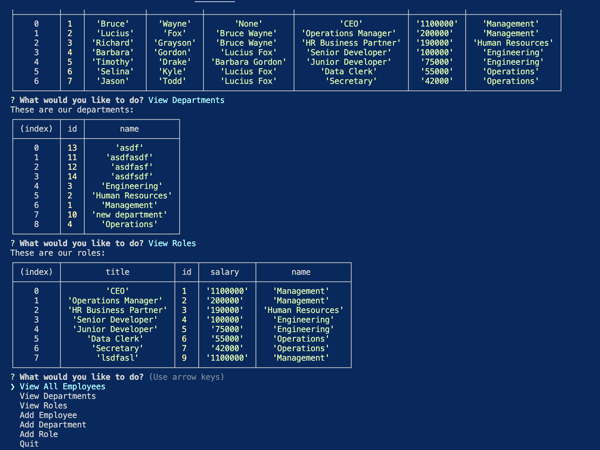

# Employee management submission
  

  ## Adds employees, roles, and departments using inquirer and mysql databases
  
  ## Table of Contents
  
  - [Installation](#installation)
  
  - [Contribution](#contribution)
  
  - [Visuals](#visuals)
  
  
  - [Questions](#questions)
  
  ---------------------------------

  ## Installation
  
  To install the necessary dependencies, run the following command:
  
-----------------------------------------------
  
 npm i
 
-------------------------------------------------
  
  ## Contribution

  Uses double quotes
  
  ## Visuals

  
  
  
  ## Questions
  
  If you have any questions about this repo, contact me at Vbamalie@mgail.com. You can find more of my work at [VBamalie](https://github.com/VBamalie/).